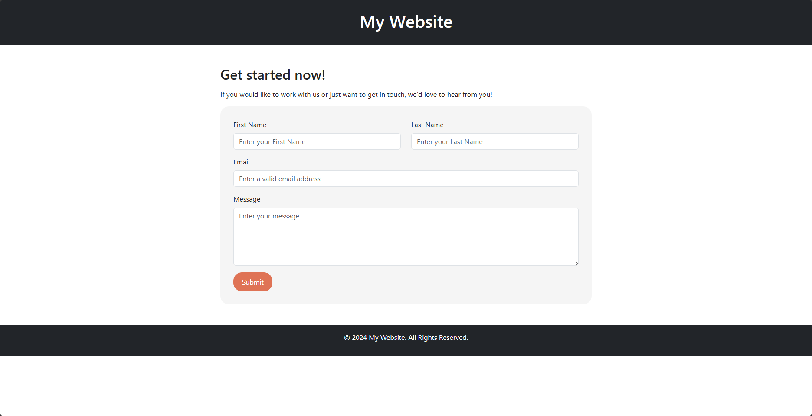

# PHP Mail Form Example

A simple PHP mail form example using Bootstrap for styling.

## Features

- Contact form with fields: Name, Email, and Message.
- Form validation using HTML5 and PHP.
- Sends email using PHP's built-in `mail()` function.
- Responsive design with Bootstrap 5.

## Installation

1. **Clone the repository:**
   ```bash
   git clone https://github.com/vulct174/php-mail-form-example.git
   ```

2. **Navigate to the project directory:**
   ```bash
   cd php-mail-form-example
   ```

3. **Set up your mail configuration:**
   - Open `send_mail.php`.
   - Replace the placeholder email with your actual email address:
     ```php
     $to = 'your_email@example.com';
     ```

4. **Deploy on a server with PHP support:**
   - Place the project folder in your web server directory (`htdocs` for XAMPP, `www` for WAMP, etc.).

## Usage

1. Open the form in your browser:
   ```
   http://localhost/php-mail-form-example/
   ```

2. Fill in your **Name**, **Email**, and **Message**.

3. Click **Send Message**. If configured correctly, the email will be sent to the specified recipient.

## Requirements

- PHP 5.6 or higher.
- A server with mail sending capabilities (e.g., XAMPP, WAMP, LAMP).

## Troubleshooting

- **Mail not sent?**
  - Ensure your server is configured to send emails.
  - On local servers like XAMPP, set up **sendmail** or use SMTP.

- **Validation issues?**
  - Check if all required fields are filled and the email format is correct.

## Screenshot



## License

This project is licensed under the [MIT License](LICENSE).

## Acknowledgments

- [Bootstrap 5](https://getbootstrap.com/) for the responsive UI.
```